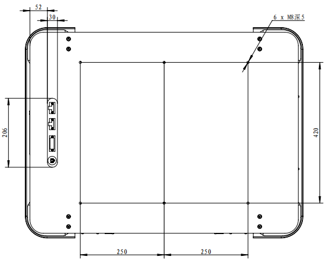

应用
================

.. toctree:: 
    :maxdepth: 5

上层机构
-------------------------
AMR可扩展上层机构，满足不同行业的负载及场景需求

- 复合机器人
- 顶升机器人
- 潜伏机器人

更多详细内容，请咨询销售人员。

安装孔位
~~~~~~~~~~~~~~~~~~~~~~~~~~~~~~

.. centered:: 图表 8-1 安装孔位