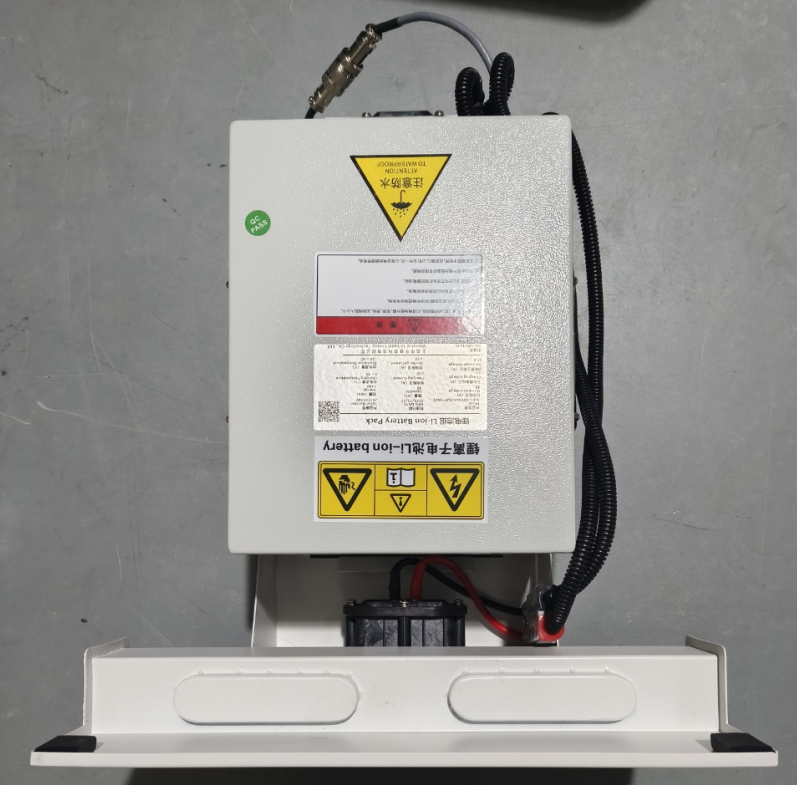
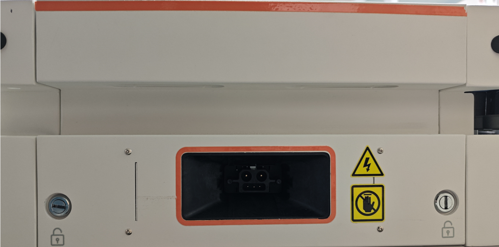

周期维护
====================

.. toctree:: 
    :maxdepth: 5

维护说明
----------------------------
进行维护或故障处理活动任何保养前，请仔细阅读本章节、本手册及相关手册内容，充分了解安全维护和故障处理流程。

只有通过安全和其他相关培训并经过授权人员方可对机器人系统进行维护。其他相关培训包括由制造商、经销商、当地进口商进行的机器人系统培训、维护保养培训。

操作人员应依据各国规定参加安全培训。

.. note:: 
   .. image:: image/002.png
      :height: 0.75in
      :align: left

   名称：**机器人部件使用注意事项**
   
   仅允许使用经批准的部件。
   
   如果擅自使用未经批准的部件，本公司将不承担任何责任。对于因使用未经批准的部件而导致机器人、附件或任何其他设备发生的任何损坏，本公司概不负责。

.. note:: 
   .. image:: image/002.png
      :height: 0.75in
      :align: left

   名称：**机器人维护注意事项**
   
   严格按照本手册描述进行维护保养。不可擅自拆除、变更本手册未描述的任何部件。错误的拆除、变更部件或错误的维护保养可能导致机器人系统工作异常和产生严重的安全问题。
   
   当遇到紧急情况需要进入机器人工作区时，应停止系统。

   请在指定保养区域进行保养和维修活动。在进行任何保养前，确保将机器人从系统中移除并关闭机器人电源，避免机器人可能会收到系统指令而突然移动。可能会收到系统指令而突然移动。

周期维护
----------------------------

.. centered:: 表 6-1 周期维护

.. list-table::
   :widths: 30 40 30
   :header-rows: 0
   :align: center

   * - **部件**
     - **维护方式**
     - **维护周期**

   * - 外壳
     - 检查是否有裂缝，检查安装情况。
     - 每月一次，按需更换。

   * - 驱动轮
     - 检查表面纹路磨损情况。
     - 每月一次，按需更换。

   * - 万向轮
     - 检查表面纹路磨损情况，检查轮子是否缠上杂物。
     - 每月一次，按需更换。

   * - 激光
     - 检查表面是否有划痕、裂缝。
     - 每周一次，按需更换。

   * - 急停按钮
     - 检查是否可以正常按下并旋转回弹
     - 每三个月一次，按需更换。

   * - 安全标贴
     - 检查是否磨损或清晰可见。
     - 每六个月一次，按需更换。
		
更换电池
~~~~~~~~~~~~~~~~~~~~~~~~~~~~
机器人电池损坏或到达电池规定的使用寿命时，可按照以下步骤更换：

1. 将机器人关机。使用钥匙打开并拉开电池舱门，手动拆卸图中三处连接端方可拆卸电池。

.. centered:: 图表 6-2 更换电池

2. 换上新的电池，合上舱门，旋紧钥匙，确保舱门关闭，更换完成。左侧为关闭状态，右侧为开启状态。

.. centered:: 图表 6-3 电池舱门示意图

清洁
-----------------------

地面清洁要求：

- 每天检查地面情况，及时清理灰尘、异物和液体污染，防止机器人打滑。
- 及时清理万向轮在地面留下的痕迹，避免产生重度痕迹。

激光清洁
~~~~~~~~~~~~~~~~~~~~~~~~~~~

.. note:: 
   .. image:: image/003.png
      :height: 0.75in
      :align: left

   名称：**激光清洁注意事项**
   
   不清洁或者不当地清洁激光，可能会导致以下问题：

   1. 机器人无法检测到标志/托盘货架。
   
   2. 机器人在无明确原因的情况下进入急停状态。

请按照下列说明清洁激光，否则可能会导致激光镜片损坏或功能失效：

- 保持激光玻璃面清洁，定期清理灰尘。
- 切勿干擦激光玻璃面。请使用沾湿的软布清洁，必要时加入少许清洁剂。
- 切勿使用具有腐蚀性的溶剂型清洁剂，如丙酮。

存放
---------------------

机器人存放
~~~~~~~~~~~~~~~~~~~~~~~~~~~~~~

- 长期停用的机器人在存放时应采取防腐措施，断开电池与AMR的连接，保证每月一次对电池补充电。
- 电池存放
- 电池组应贮存在环境温度0-40℃，相对湿度为10%-90%RH的条件下。
- 电池组应避免与腐蚀性物质或磁性环境接触。
- 电池组存贮在清洁、干燥、通风的环境中，远离火源或热源。
- 电池组在长期存放不使用的时候，每月对电池组进行充放电一次。

充电器存放
~~~~~~~~~~~~~~~~~~~~~~~~~~~~
- 当充电器不使用时，应放在包装盒内。
- 仓库极限温度应在-20~70℃，常态温度应在-20~50℃，相对湿度为5~90%，并且仓库内不能有有害气体，易燃品，爆炸品，腐蚀性等化学物品及强有力的机械震动、冲击和磁场影响。
- 包装盒需放在距离地面至少20cm高，距离墙，热源，和通风口50cm远。充电器在此种存储条件下可以放两年，超过两年须重新检测。
- 充电器必须每三个月通电一次，通电时间应不少于0.5小时。

包装运输
--------------------------------
运输机器人时，请使用原包装材料。

原包装包含：

- 包装箱体
- 包装盖板（斜坡）
- 斜坡辅助木板
- 包装侧板
- 珍珠泡棉保护块

包装机器人步骤

将机器人关机。

按照相反的顺序执行4.2开箱的步骤。

电池运输

- 电池运输须遵循相关法规，根据不同的运输方式（陆运、海运或空运），具体规定略有不同。
- 确保遵守本章中的安全预防措施和指导来运输电池。
- 电池应包装成箱进行运输。在运输过程中应防止剧烈震动、冲击或挤压，防止日晒雨淋。

典型故障分析处理
----------------------------------

安全警告
~~~~~~~~~~~~~~~~~~~~~~~~~

.. warning:: 
    高压危险！ 电池包内含高压直流电，非专业人员禁止拆卸。

    短路风险！ 操作时必须使用绝缘工具，防止正负极短路。

    灼伤风险！ 电池故障时可能有高温、电解液泄漏风险，操作时需佩戴绝缘手套和护镜。

    先断电，后操作！ 在进行任何检查或连接断开操作前，请务必确保AMR已完全关机，并断开电池包的主电源开关或连接器。

故障诊断流程
~~~~~~~~~~~~~~~~~~~~~~~~~
当AMR出现与电源相关的故障时，请遵循以下通用流程：

**观察现象**：确认AMR的具体表现（如：无法开机、突然关机、电量显示不准、无法充电等）。

**检查报警**：查看AMR人机界面上位机系统上的电池故障报警代码。

**初步排查**：进行基础物理检查（如：接线是否松动、充电触点是否清洁、熔断器是否正常）。

**记录与上报**：详细记录故障代码、处理过程和结果。对于复发性或无法解决的故障，及时上报至供应商技术人员协调排查。

AMR电池系统典型故障分析
~~~~~~~~~~~~~~~~~~~~~~~~~~~~~~~~~

.. centered:: 表 6-2 AMR电池系统典型故障对照表

.. list-table::
   :widths: 20 30 30 20
   :header-rows: 0
   :align: center

   * - **故障代码/现象**
     - **可能原因**
     - **排查步骤**
     - **解决方案与预防措施**

   * - 代码: E01 (示例：电池过压)	
     - 1. 充电器输出电压异常偏高
     - 1. 使用万用表测量充电器空载输出电压是否在规格范围内
     - 1. 立即停止充电！

   * - 代码: E01 (示例：电池过压)	
     - 2. 电池管理系统(BMS)电压采样电路故障
     - 2. 通过BMS调试工具读取单体电芯电压，检查是否有个别电芯电压异常
     - 2. 联系充电器供应商检修

   * - 代码: E01 (示例：电池过压)	
     - 3. 电芯均衡功能失效，导致个别电芯电压过高
     - 3. 检查BMS日志记录
     - 3. 对电池包进行专业均衡维护或更换需专业人事处理

   * - 代码: E02 (示例：电池欠压)
     - 1. AMR任务量过大，电量耗尽
     - 1. 检查AMR运行日志，确认无超负荷运行
     - 1. 立即前往充电！ 严重欠压会永久损伤电池

   * - 代码: E02 (示例：电池欠压)
     - 2. 存在待机功耗过大或轻微短路，导致电池缓慢放电
     - 2. 检查AMR在关机状态下的静态功耗是否超标
     - 2. 优化任务调度，设置合理的低电量回充阈值

   * - 代码: E02 (示例：电池欠压)
     - 3. 电池长期存放后自放电
     - 3. 对电池进行充电，观察是否能正常充满
     - 3. 对于长期存放的AMR，需定期补充电

   * - 代码: E03 (示例：充电过流)	
     - 1. 充电触点短路或阻抗过大
     - 1. 检查机器人及充电器的充电触点是否有烧蚀、污物，测量接触电阻
     - 1. 清洁或更换充电触点

   * - 代码: E03 (示例：充电过流)	
     - 2. 电池内部短路
     - 2. 测量电池内阻是否在正常范围
     - 2. 停止使用并更换故障电池包

   * - 代码: E03 (示例：充电过流)	
     - 3. BMS电流传感器故障
     - 3. 使用钳形表校准BMS电流测量值
     - 3. 更换BMS或相关传感器

   * - 代码: E05 (示例：电池高温)
     - 1. 环境温度过高或通风不良
     - 1. 测量环境温度，检查AMR运行场地
     - 1. 将AMR移至阴凉通风处

   * - 代码: E05 (示例：电池高温)
     - 2. 持续大电流放电
     - 2. 检查任务周期是否过于密集
     - 2. 降低运行强度或增加休息间隔

   * - 代码: E05 (示例：电池高温)
     - 3. 冷却系统（如有）故障（风扇不转）
     - 3. 检查电池包冷却风扇是否正常工作
     - 3. 清理风扇灰尘或更换风扇

   * - 代码: E05 (示例：电池高温)
     - 4. 温度传感器故障
     - 4. 通过BMS读取多个温度传感器数值，交叉验证
     - 4. 预防： 改善运行环境，保持通风道畅通

   * - 代码: E06 (示例：电池低温)	
     - 1. 环境温度过低
     - 1. 测量环境温度
     - 1. 将AMR移至温暖环境

   * - 代码: E06 (示例：电池低温)	
     - 1. 温度传感器故障
     - 2. 交叉验证其他温度传感器读数
     - 2. 如果AMR配备电池加热功能，确保其正常工作

   * - 代码: E06 (示例：电池低温)	
     -  
     - 
     - 3. 预防：在低温仓库使用的AMR，必须标配电池加热系统

AMR驱动器系统报警代码
~~~~~~~~~~~~~~~~~~~~~~~~~~~~~~~~~~~~~~~~~~

.. centered:: 表 6-3 伺服驱动器故障代码表

.. list-table::
   :widths: 20 30 50
   :header-rows: 0
   :align: center

   * - **故障码**
     - **故障名称**
     - **处理方法**

   * - 1
     - 软件过流故障
     - | 1、检查关节负载或阻力是否变大或异常
       | 2、若故障仍未排除，维修或更换驱动板

   * - 2
     - 过压故障
     - 降低机器人运行速度或加速度

   * - 3
     - 欠压故障
     - | 1、检查控制箱48V 电源电压输出是否异常
       | 2、检查驱动板和关节外壳是否短路
       | 3、若故障仍未排除，维修或更换驱动板

   * - 4
     - 过热故障
     - 减小机器人负载或降低机器人运行速度

   * - 5
     - 过载故障
     - 减小机器人负载或降低机器人运行速度

   * - 6
     - 超速故障
     - | 1、检查磁编组件和电机轴固定顶丝是否松动
       | 2、重新进行编码器校零
       | 3、若故障仍未排除，维修或更换磁编组件
 
   * - 7
     - 参数异常故障
     - 维修或更换驱动板
 
   * - 8
     - 飞车故障
     - | 1、检查磁编组件和电机轴固定顶丝是否松动
       | 2、重新进行编码器校零
       | 3、若故障仍未排除，维修或更换磁编组件
 
   * - 9
     - 位置误差故障
     - | 1、检查关节负载或阻力是否变大或异常
       | 2、若故障仍未排除，维修或更换驱动板
 
   * - 10
     - 位置溢出故障
     - | 1、检查硬限位是否松动
       | 2、重新进行机器人校零	
 
   * - 11
     - 硬件过流故障
     - 维修或更换驱动板
 
   * - 12
     - 驱动禁止故障
     - 未启用
 
   * - 13
     - 电机堵转故障
     - | 1、检查刹车电磁铁是否吸合
       | 2、检查是否撞到硬限位
       | 3、若故障仍未排除，维修或更换驱动板
        
   * - 14
     - 功率电源故障
     - 未启用
        
   * - 15
     - STO 故障
     - 未启用
        
   * - 16
     - 相电流 AD 调零故障
     - 维修或更换驱动板
        
   * - 17
     - EEPROM 故障
     - 维修或更换驱动板
        
   * - 18
     - 霍尔故障
     - | 1、检查霍尔线束是否插接牢固，有无短路、断路
       | 2、若故障仍未排除，维修或更换关节
            
   * - 19
     - 编码器故障
     - 维修或更换磁编组件
            
   * - 20
     - 编码器调零故障
     - | 1、重新进行编码器校零
       | 2、若故障仍未排除，维修或更换磁编组件
                   
   * - 21
     - 编码器Z相信号丢失故障
     - 未启用
                   
   * - 22
     - 编码器计数故障
     - 未启用
                   
   * - 23
     - 编码器多圈数据溢出故障
     - 未启用
                   
   * - 24
     - 外部时钟故障
     - 维修或更换驱动板
                   
   * - 25
     - UVW 相序故障
     - 未启用
                   
   * - 26
     - FPGA故障
     - 未启用
                   
   * - 27
     - 回零故障
     - 未启用
                   
   * - 28
     - 磁编码器故障
     - | 1、检查磁编组件和电机轴固定顶丝是否松动
       | 2、若故障仍未排除，维修或更换磁编组件
                   
   * - 29
     - 电机动力线断线故障
     - | 1、检查电机动力线是否插接牢固，有无短路、断路
       | 2、若故障仍未排除，维修或更换驱动板
                   
   * - 30
     - EtherCAT故障
     - | 1、检查网线是否插接牢固，有无短路、断路
       | 2、若故障仍未排除，维修或更换驱动板
                   
   * - 31
     - EtherCAT_SM_DOG故障
     - | 1、检查网线是否插接牢固，有无短路、断路
       | 2、若故障仍未排除，维修或更换驱动板
                   
   * - 32
     - EtherCAT_FATALSYNC故障
     - | 1、检查网线是否插接牢固，有无短路、断路
       | 2、若故障仍未排除，维修或更换驱动板
                   
   * - 33
     - EtherCAT_SYNC故障
     - | 1、检查网线是否插接牢固，有无短路、断路
       | 2、若故障仍未排除，维修或更换驱动板
                   
   * - 34
     - EtherCAT_RFT故障
     - | 1、检查网线是否插接牢固，有无短路、断路
       | 2、若故障仍未排除，维修或更换驱动板
                   
   * - 35
     - 驱动器轴地址故障
     - | 1、重新进行驱动器轴地址配置
       | 2、若故障仍未排除，维修或更换驱动板
                   
   * - 36
     - 机器人校零故障
     - | 1、重新进行机器人校零
       | 2、先使用JLINK 擦除 FLASH，再重新下载程序并校零
       | 3、若故障仍未排除，维修或更换驱动板
                   
   * - 37
     - 编码器通讯故障
     - | 1、检查编码器线束是否插接牢固，有无短路、断路
       | 2、若故障仍未排除，维修或更换磁编组件
                   
   * - 40
     - 磁编模块故障-校零故障
     - | 1、重新进行磁编组件校零
       | 2、若故障仍未排除，维修或更换磁编组件
                   
   * - 41
     - 磁编模块故障-多圈故障
     - | 1、检查磁编组件和电机轴固定顶丝是否松动
       | 2、若故障仍未排除，维修或更换磁编组件
                   
   * - 42
     - 磁编模块故障-多圈小磁编故障
     - | 1、检查多圈小磁编芯片是否异常
       | 2、若故障仍未排除，维修或更换磁编组件
                   
   * - 43
     - 磁编模块故障-多圈大磁编故障
     - | 1、检查多圈大磁编芯片是否异常
       | 2、若故障仍未排除，维修或更换磁编组件
                      
   * - 44
     - 磁编模块故障-单圈磁编故障
     - | 1、检查单圈磁编芯片是否异常  
       | 2、若故障仍未排除，维修或更换磁编组件
                      
   * - 45
     - 磁编模块故障-光编故障
     - | 1、检查光编码盘是否被污染或未粘牢
       | 2、若故障仍未排除，维修或更换磁编组件

