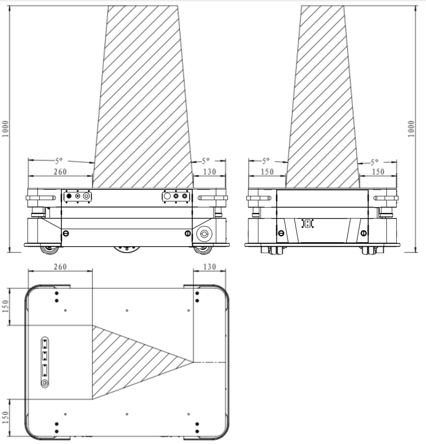

有效荷载规格
================

.. toctree:: 
    :maxdepth: 5

有效负载
--------------------------
1. 机器人有效载荷300kg；
2. 机器人载荷应该均匀，边缘不得超出AMR上台面区域，最高点离地面最大高度≤1800mm；载荷重心不得超出图表6.1-1所示范围。

.. centered:: 图表 7-1 负载重心范围