产品介绍
======================

.. toctree:: 
    :maxdepth: 5

简介
-------------------------
AMR是一款采用激光SLAM的通用移动机器人底盘。产品提供了核心的地图构建和定位导航功能，并预留了丰富的I/O、EtherCat/net等接口用于扩展上层机构，从而帮助用户快速实现移动机器人的各种应用。

- 本产品由法奥意威(苏州)机器人系统有限公司研发及设计。
- 法奥意威(苏州)机器人系统有限公司©保留所有权利。
- 本文档的一些名称以及可能的其他名称不带注册商标符号®，它们均为法奥意威(苏州)机器人系统有限公司的注册商标。

产品尺寸
-------------------------

机器人尺寸
~~~~~~~~~~~~~~~~~~~~~~~~~~~~~~~

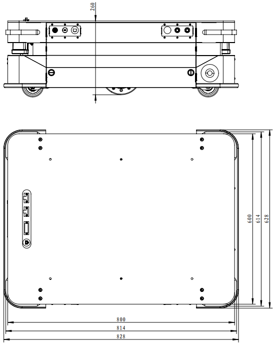

.. centered:: 图表 3-1 机器人尺寸

主要标签
-------------------------

注意事项
~~~~~~~~~~~~~~~~~~~~~~~~~~~~~~~

.. centered:: 图表 3-2 注意事项

铭牌
~~~~~~~~~~~~~~~~~~~~~~~~~~~~~~~

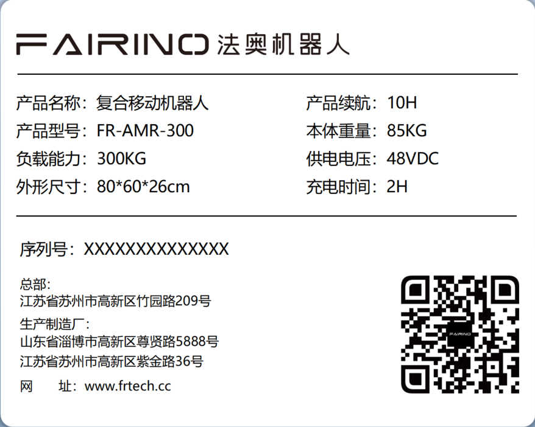

.. centered:: 图表 3-3 本体铭牌

.. figure:: image/011.png
   :align: center
   :width: 4in

.. centered:: 图表 3-4 包装箱铭牌

激光系统
-------------------------

AMR配置欧镭激光 1B-S5激光，主要功能如下：

- 扫描地图
- 定位导航
- 识别障碍物

检测范围
~~~~~~~~~~~~~~~~~~~~~~~~~~~~~~~

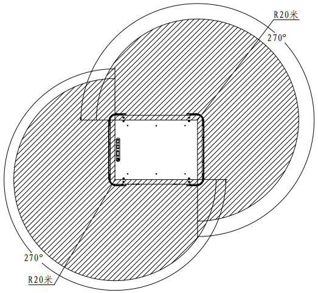

.. centered:: 图表 3-5 检测范围

.. centered:: 表3-1 检测范围

.. list-table::
   :widths: 20 40 80
   :header-rows: 0
   :align: center

   * - **型号**
     - **定义**
     - **参数**

   * - AMR-300
     - 检测距离
     - 20m

   * - AMR-300
     - 检测角度
     - 270°

检测盲区
~~~~~~~~~~~~~~~~~~~~~~~~~~~~~~~

由于激光传感器的特性，低于或者高于激光检测高度的物体均不能被检测到。

激光特性及使用限制说明
~~~~~~~~~~~~~~~~~~~~~~~~~~~~~~~

有效距离
+++++++++++++++++++++++++
欧镭激光1B-S5激光正常运行时的有效距离为0.1m~25m，因此当激光非常靠近物体或者很远时时，激光的数据可能并不准确，因此在使用时不应将激光特别靠近墙面或其他物体（需要至少留出10cm空间）。

镜面反射物体
+++++++++++++++++++++++++

由于激光测量是跟根据接收反射回来的激光计算距离，因此各种不同材质的物体会对激光测量产生不同的影响，对于自然物体的材质表面，只要是漫反射均匀的，激光照射到该物体表面的噪声就比较小，测量精度较高。表面光滑的，主要是镜面反射的物体，测量噪声就会比较大，测量精度会下降。因此，如果环境中充斥着镜面反射物体，机器人可能无法构建精准的环境地图，从而无法稳定且精准的导航。

黑色物体
+++++++++++++++++++++++++

对于反射率在10%的黑色物体，激光的有效测量距离是0.1m~8m。对于反射率更低的黑色物体，激光就有可能不能识别到或者测量的距离不准确。因此，如果环境中充斥着低反射率的黑色物体，机器人可能无法构建精准的环境地图，从而无法稳定且精准的导航。

激光互相之间的干扰AMR配置欧镭激光 1B-S5激光，主要功能如下：

扫描地图
************************
由于激光传感器的特性，低于或者高于激光检测高度的物体均不能被检测到。

AMR出厂时，已设置好测试环境默认减速和停止区域。在建立地图后规划好的避障区域内可以实现检测到障碍时减速和停止。

欧镭激光1B-S5激光正常运行时的有效距离为0.1m~25m，因此当激光非常靠近物体或者很远时时，激光的数据可能并不准确，因此在使用时不应将激光特别靠近墙面或其他物体（需要至少留出10cm空间）。

由于激光测量是跟根据接收反射回来的激光计算距离，因此各种不同材质的物体会对激光测量产生不同的影响，对于自然物体的材质表面，只要是漫反射均匀的，激光照射到该物体表面的噪声就比较小，测量精度较高。表面光滑的，主要是镜面反射的物体，测量噪声就会比较大，测量精度会下降。因此，如果环境中充斥着镜面反射物体，机器人可能无法构建精准的环境地图，从而无法稳定且精准的导航。

对于反射率在10%的黑色物体，激光的有效测量距离是0.1m~8m。对于反射率更低的黑色物体，激光就有可能不能识别到或者测量的距离不准确。因此，如果环境中充斥着低反射率的黑色物体，机器人可能无法构建精准的环境地图，从而无法稳定且精准的导航。

一般激光在设计的时候通常都做了多激光干扰的防护，避免产生相互干扰，但是激光厂商推荐在使用多激光时使用下面这种安装方式来完全避免它们之间的相互干扰。通过增加激光安装的倾斜角来消除激光之间的干扰，对于激光SLAM的应用，应该把倾角朝上，而不是朝下。

一般激光在设计的时候通常都做了多激光干扰的防护，避免产生相互干扰，但是激光厂商推荐在使用多激光时使用下面这种安装方式来完全避免它们之间的相互干扰。通过增加激光安装的倾斜角来消除激光之间的干扰，对于激光SLAM的应用，应该把倾角朝上，而不是朝下。

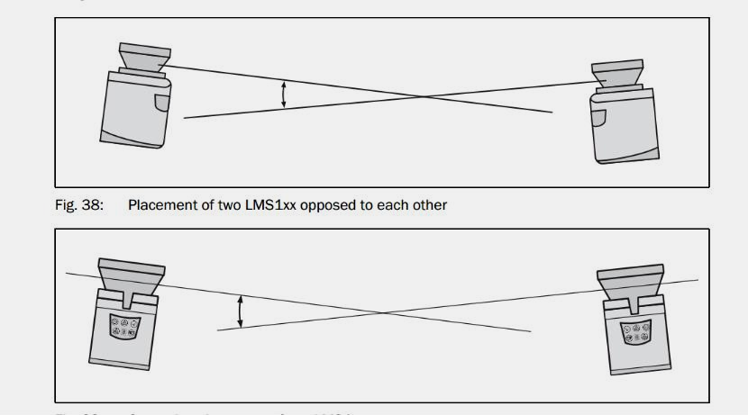

.. centered:: 图表 3-6 激光互相之间的干扰

强光的影响
************************
通常室内用激光的环境光抗扰度约为40klux~80klux，一般室内的光照强度都小于这个数值，因此室内的光照对激光不会产生影响，但需要尽量避免阳光直射。

环境变动对激光SLAM的影响
****************************************
激光SLAM的原理是通过激光雷达扫描环境的轮廓从而构建环境的点云地图，然后依据已构建好的点云地图与激光扫描到的实时点云做匹配来进行定位导航的。因此，如果地图构建后环境轮廓发生较大的改变（>30%），机器人可能无法达到预期的高精度，如果环境轮廓发生更大的变化（>60%），机器人可能出现偏离路径甚至定位丢失的情况。所以，对于需要在环境经常发生较大改变的场景中使用激光SLAM，请考虑增加其他辅助措施，如启用在线SLAM、部署反光板或二维码等。

电池系统
-------------------------

电池基本性能参数
~~~~~~~~~~~~~~~~~~~~~~~~~~~~~

.. centered:: 表3-2 电池系统

.. list-table::
   :widths: 50 50
   :header-rows: 0
   :align: center

   * - **参数类型**
     - **具体参数**

   * - 电池类型
     - 磷酸铁锂

   * - 标称电压
     - 48V

   * - 标称容量
     - 30AH

   * - 标准充电电流
     - 15A

   * - 充电截止电压
     - 54V

   * - 允许最大持续充电电流
     - ≤30A

   * - 标准放电电流
     - 15A

   * - 放电截止电压
     - 37.5V

   * - 允许最大持续放电电流
     - ≤30A

   * - 瞬间最大放电电流
     - ≤66A@6S

   * - 充电温度
     - 0℃〜55℃

   * - 放电温度
     - -20℃〜60℃

   * - 存贮温度
     - -40℃〜40℃（≤3个月）

   * - 存贮温度
     - 10℃〜35℃（3个月至1年）

   * - 箱体尺寸（mm）
     - 约255*200*150mm

   * - IP防护等级
     - IP54

   * - 循环寿命
     - ≥1500次@80%SOC5

   * - 重量（Kg）
     - 约12.5KG

声光系统
-------------------------

氛围灯
~~~~~~~~~~~~~~~~~~~~~~~~~~~~~~~

机器人通过氛围灯的颜色、形态变化指示当前运行状态。

.. centered:: 表3-3 氛围灯

.. list-table::
   :widths: 50 50
   :header-rows: 0
   :align: center

   * - **氛围灯显示**
     - **状态**

   * - 红色
     - 急停状态

   * - 绿色
     - 运行状态

   * - 蓝色
     - 当前样机的三色灯中，蓝色灯暂未启用，后续可根据现场实际需求进行添加。

蜂鸣器
~~~~~~~~~~~~~~~~~~~~~~~~~~~~~~~

AMR配置蜂鸣器用于报警提示，蜂鸣器工作于以下情况：

1. 当机器人出现Fatal和Error级别的报错时。

技术参数
-------------------------

.. centered:: 表3-4 技术参数

.. list-table::
   :widths: 50 50
   :header-rows: 0
   :align: center

   * - **参数类型**
     - **具体参数**

   * - 型号参数
     - FR-AMR-300

   * - 有效负载
     - 300KG

   * - 旋转直径
     - 990mm

   * - 定位精度
     - ±15mm，±1°

   * - 最大运行速度
     - 2m/s

   * - 驱动方式
     - 双轮差速

   * - 导航方式
     - 激光 Slam

   * - 通过性
     - 坡度≤5%，台阶≤1cm，间隙≤1cm

   * - 防护等级
     - IP20

   * - 前后激光避障
     - 数量2，覆盖360°

   * - 急停按钮
     - 数量2，对角各1个

   * - 接触式防护
     - 压电触边开关

   * - 声光报警
     - 标配

   * - 供电接口
     - 48V，24V

   * - 通信接口
     - RJ45

   * - 外形尺寸
     - 800×600×260mm

   * - 整机重量
     - 85KG

   * - 工作温度
     - 0⁓45℃

   * - 工作湿度
     - 90%RH

   * - 设备材料
     - 钢

   * - 外壳颜色
     - 白色细砂纹

   * - 电池材质
     - 磷酸铁锂

   * - 充电时间
     - ≤2h

   * - 电池规格
     - 48V，30Ah

   * - 续航
     - 10h
	
1. 路面平整、清洁，无明显起伏。度5%=arctan(0.05)≈2.8°。机器人不可在坡道、台阶、间隙处停止或转向，只可垂直于坡道、台阶、间隙快速通过。
2. 定位精度通常指机器人导航到目标站点的重复精度，在机器人激光雷达扫描到的环境相对稳定的情况下，机器人从固定方向导航到目标站点的重复精度能达到预期的值。机器人沿虚拟路径运行时，会尽量贴合路径，但不保证可重复性。即机器人能保证到点精度，而不保证路径贴合精度。不可将机器人当作直线导轨使用。
3. 基础功能包括地图编辑、升级模块、日志模块、导航模块、API接口等。
4. AMR仅设计用于室内运输，不推荐用于室外环境。

软件功能
-------------------------

模式切换功能
~~~~~~~~~~~~~~~~~~~~~~~~~~~~~~~

功能描述
++++++++++++++++++++++++++++++

控制系统运行的核心安全功能，用于在手动模式与自动模式之间进行切换。

**手动模式**：允许操作员通过虚拟摇杆等设备直接控制机器人移动，适用于调试、建图。

**自动模式**：机器人执行导航任务，按照规划路径导航，并自动避障。

操作流程
++++++++++++++++++++++++++

1) 进入模式切换界面

在主控制界面顶部状态栏中，找到当前模式显示区域

2) 身份验证

系统弹出 密码输入对话框。

在输入框中键入默认或管理员预设的密码：123456点击 “确认” 或按下回车键提交。

3) 执行模式切换
   
密码验证通过后，系统立即执行模式切换：

- 若当前为手动模式，则切换为自动模式。
- 若当前为自动模式，则切换为手动模式。

.. figure:: image/014.png
   :align: center
   :width: 6in

.. centered:: 图表 3-7 模式切换

手动摇杆控制功能
~~~~~~~~~~~~~~~~~~~~~~~~~~~~~~~

功能描述
++++++++++++++++++++
此部分功能允许用户通过软件界面直接与AMR进行交互，包括手动控制、环境建图。

操作流程
+++++++++++++++++++++++

1) 确保机器人处于手动模式，并确认周围有足够的安全空间。
2) 找到并注视界面上的虚拟摇杆组件。
3) 将鼠标光标移至摇杆的中心点上。
4) 按住鼠标左键，根据预期运动方向拖动摇杆中心点：
   
- 向前或向后拖动：控制机器人沿直线前进或后退；拖拽幅度越大，机器人的移动速度越快。
- 向左或向右拖动：控制机器人向左或向右进行弧线运动或原地旋转。
- 向斜向拖动：合成线速度和角速度，使机器人沿相应的曲线路径移动。
  
5) 当需要停止机器人时，释放鼠标左键，摇杆将自动回中，机器人立即停止运动。

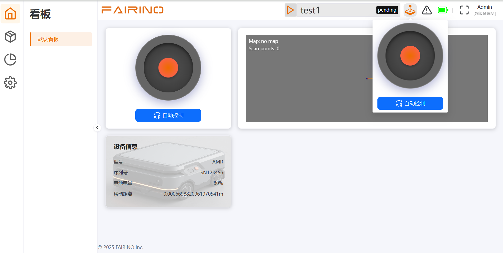

.. centered:: 图表 3-8 摇杆控制

建图功能
~~~~~~~~~~~~~~~~~~~~~~~~~~~~~~~

功能描述
+++++++++++++++++++++++++
通过手动控制机器人移动，利用其搭载的激光雷达与里程计数据，实时构建周围环境的二维栅格地图。

操作流程
+++++++++++++++++++++++++++
1) 进入地图选项，创建地图。

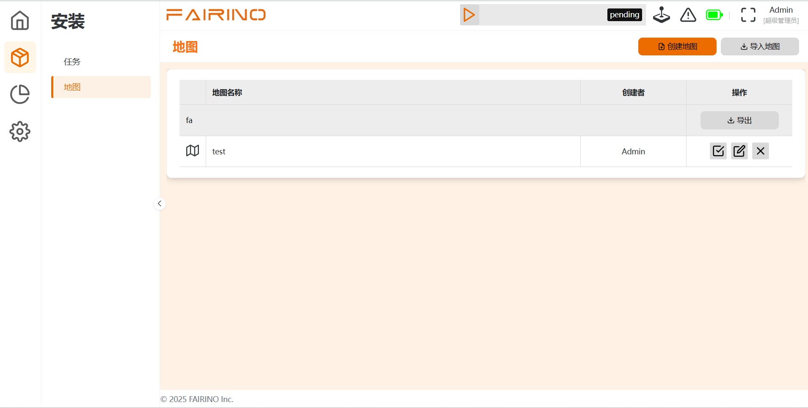

.. centered:: 图表 3-9 进入地图选项

2) 输入地图名称和站点，点击创建

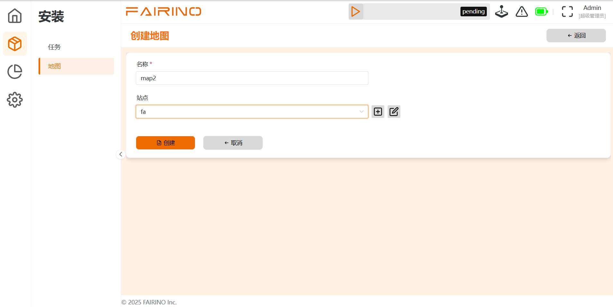

.. centered:: 图表 3-10 创建地图

3) 使用手动摇杆控制，驱动机器人在需要建图的区域内匀速、完整地移动，确保覆盖所有通道和角落。

.. figure:: image/018.png
   :align: center
   :width: 6in

.. centered:: 图表 3-11 摇杆控制

4) 在建图完成或确认当前地图无误后，点击界面上方的 “保存地图” 按钮。

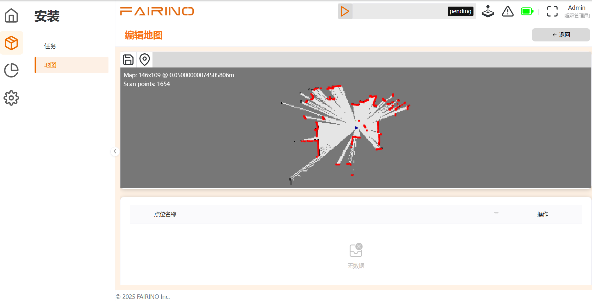

.. centered:: 图表 3-12 保存地图

加载地图
~~~~~~~~~~~~~~~~~~~~~~~~~~~~~~~

功能描述
++++++++++++++++++++++++++
从系统存储中调取一个已保存的地图文件，将其设置为当前运行地图，用于导航和任务规划。点击界面的 “加载地图” 应用按钮。

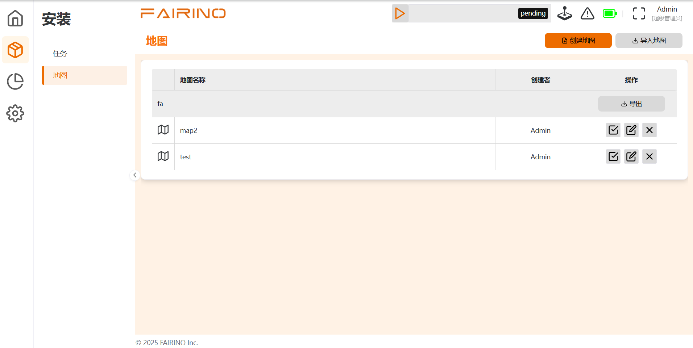

.. centered:: 图表 3-13 应用地图

记录点位
~~~~~~~~~~~~~~~~~~~~~~~~~~~~~~~

功能描述
++++++++++++++++++++++++++
在地图上标记并保存关键的位置和姿态，作为机器人自动化任务的目标点。

操作流程
++++++++++++++++++++++++++
通过手动控制或将机器人移动到目标位置。点击编译点位按钮。添加点位名称。

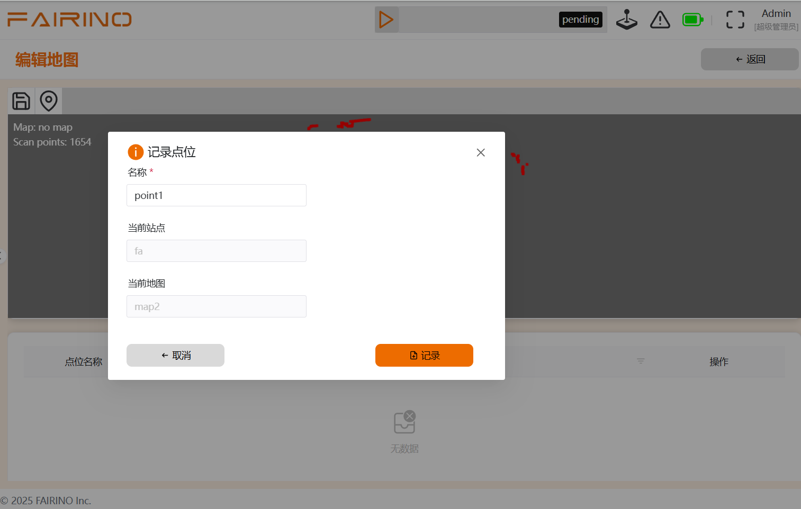

.. centered:: 图表 3-14 记录点位

创建任务
~~~~~~~~~~~~~~~~~~~~~~~~~~~~~~~

功能描述
+++++++++++++++++++++++++++++++
通过编辑AMR移动的点位，创建其执行的任务。

操作步骤
+++++++++++++++++++++++++

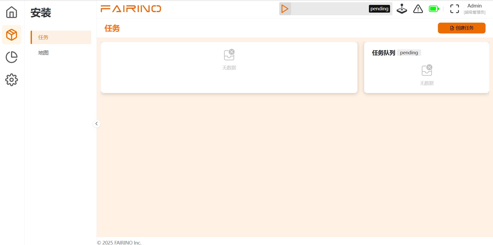

.. centered:: 图表 3-15 进入任务选项

1) 输入任务名称，创建任务。

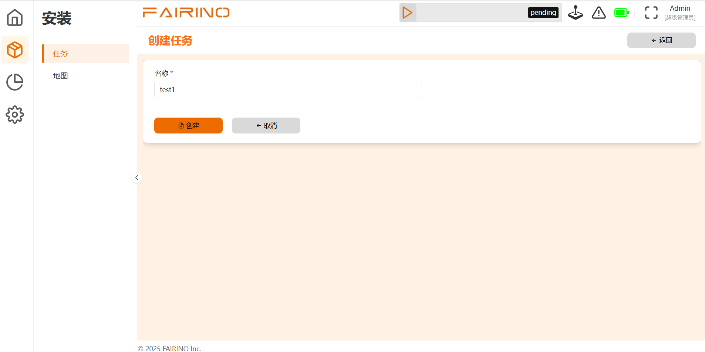

.. centered:: 图表 3-16 创建任务

2) 点击编辑任务。

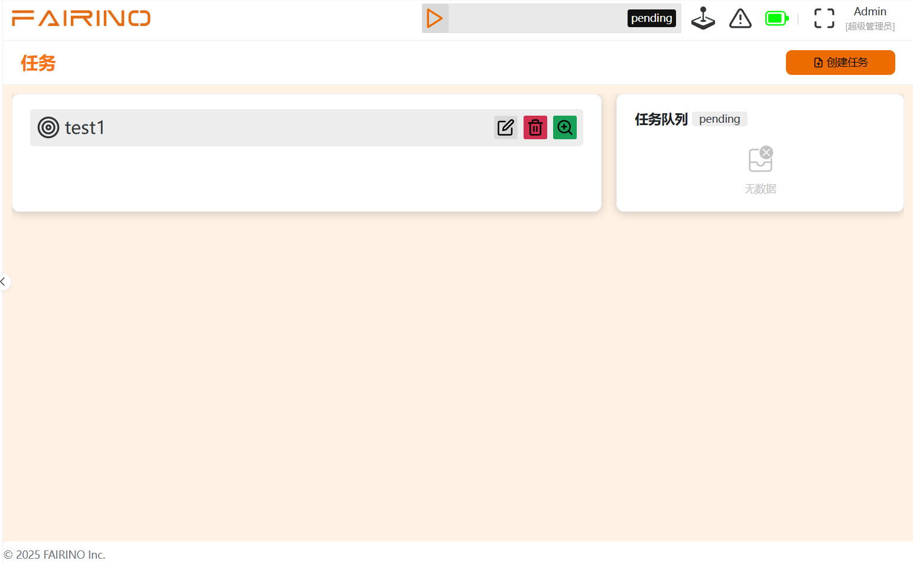

.. centered:: 图表 3-17 编辑任务

3) 可以编辑点位。

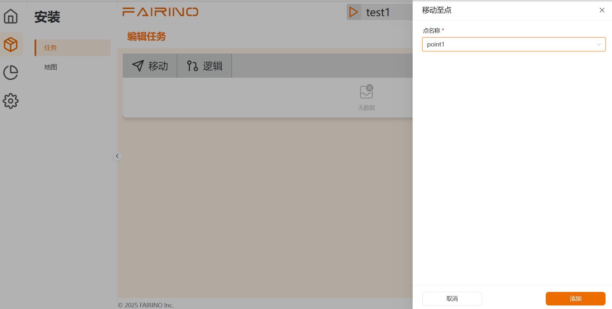

.. centered:: 图表 3-18 编辑点位

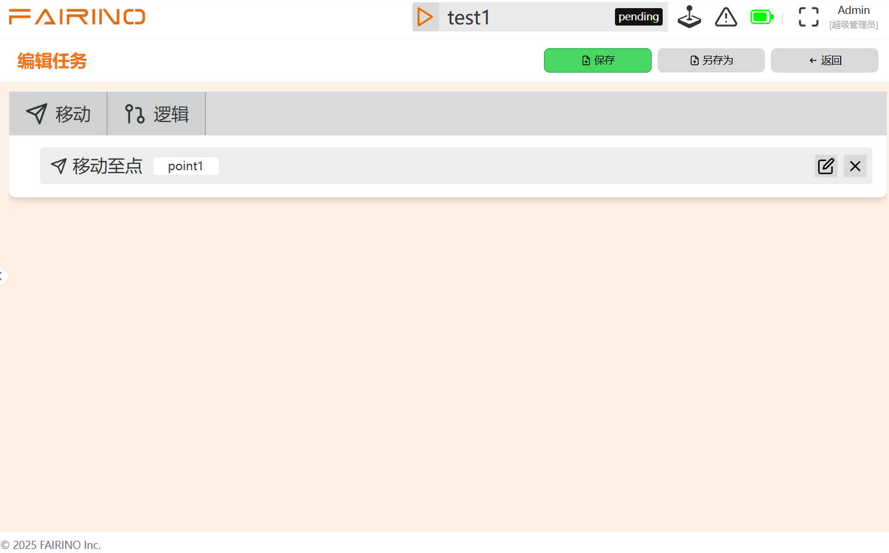

.. centered:: 图表 3-19 保存任务

4) 最后保存任务。

运行任务
~~~~~~~~~~~~~~~~~~~~~~~~~~~~~~~

功能描述
+++++++++++++++++++++++++++

执行一个已编辑并保存的任务脚本，使机器人自动完成脚本中定义的一系列任务。

操作流程
+++++++++++++++++++++++++
1) 在“脚本管理”界面中，将Lua脚本添加到任务队列。
2) 点击 “运行脚本” 按钮。用户可以在界面上实时查看机器人的任务状态。如需中断任务，可点击 “停止脚本” 按钮。

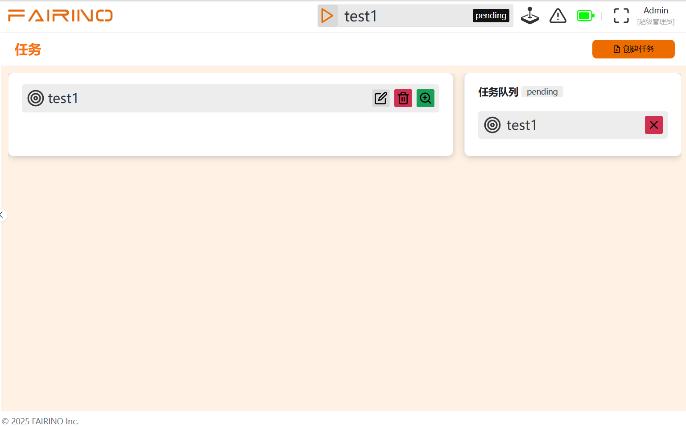

.. centered:: 图表 3-20 运行任务

日志导出功能
~~~~~~~~~~~~~~~~~~~~~~~~~~~~~~~

功能描述
++++++++++++++++++++++++++++++++
将系统运行过程中产生的各类日志数据（如机器人状态、任务记录、错误警报、操作历史等）以文件形式输出，用于离线分析、故障排查、数据审计或系统备份。

选择日志设置，系统日志，点击下载按钮可以下载日志。

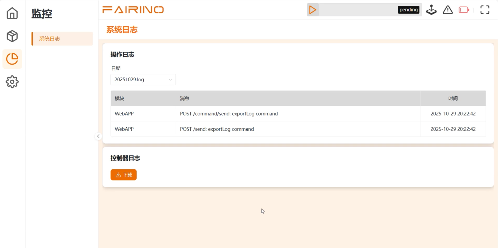

.. centered:: 图表 3-21 下载日志

参数配置
~~~~~~~~~~~~~~~~~~~~~~~~~~~~~~~

功能描述
++++++++++++++++++++++++++++
通过系统与高级设置界面，对机器人的核心运动性能及导航避障所需的代价地图参数进行调整与优化，以适配不同的运行环境和性能要求。

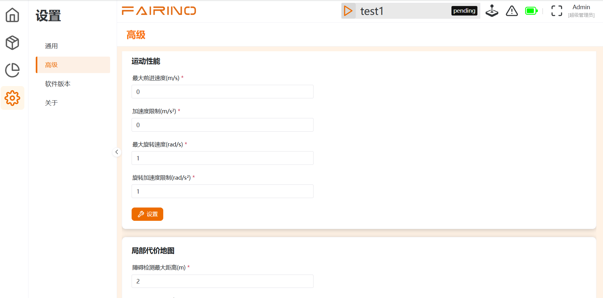

.. centered:: 图表 3-22 参数配置

升级功能
~~~~~~~~~~~~~~~~~~~~~~~~~~~~~~~

功能描述
+++++++++++++++++++++++++++
通过系统设置中的软件升级入口，检测并安装新版机器人控制系统软件，以获取新功能、性能优化或修复已知问题。

操作流程
+++++++++++++++++++++++++++++++++
1) 确认升级文件：从设备供应商或管理员处获取正确的升级软件包，并确认其版本号高于当前版本且适用于当前机器人型号。
2) 确保环境安全：将机器人移至开阔、稳定的区域，并确保升级过程中机器人不会执行任何任务，且周边没有人员或障碍物干扰。保持电源连接稳定。
3) 在软件主界面，进入“设置”，查找并点击“升级”选项。

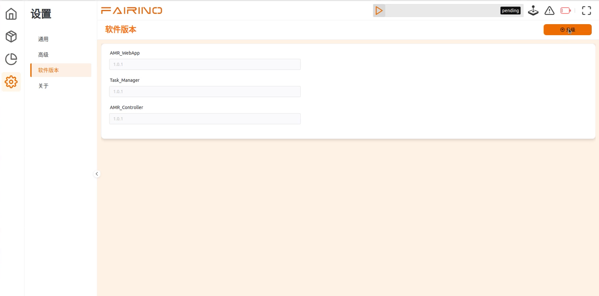

.. centered:: 图表 3-23 升级界面

4) 选择升级文件。
5) 确认无误后，点击“开始升级”或“升级”按钮。执行升级操作，等待升级完成，时间大约为20s。整个升级过程中，请勿关闭软件、断开机器人电源或进行任何其他操作，否则可能导致系统损坏。升级完成后，会提示“升级成功”。

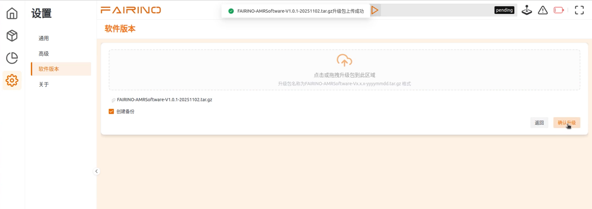

.. centered:: 图表 3-24 确认升级

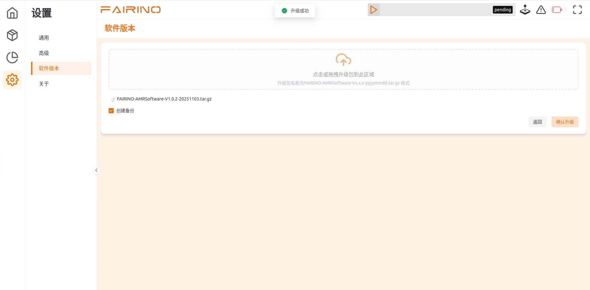

.. centered:: 图表 3-25 升级成功

6) 手动重启机器人。重启后，重新登录软件，再次进入“设置” -> “软件升级”页面，确认软件版本号已更新为目标版本。

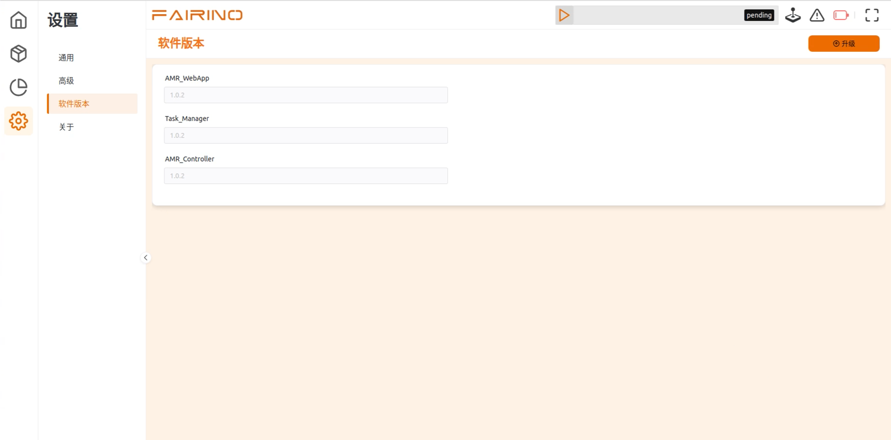

.. centered:: 图表 3-26 升级成功版本号

网络要求及配置
-------------------------

网络要求

- **无线网络协议**：IEEE 802.11 a/b/g/n client
- **宽带速度值**：≥100Mbits
- **信号强度要求**：≥-60dBm
- **网络延时要求**：平均延时时间≤100ms

安全功能清单
-------------------------

- 激光雷达主动避障
- 实时扫描路径障碍物，雷达保护区域有障碍物时触发减速或停止。
- 电池电量低保护
- 电量低于安全阈值（20%）时触发低电量报警，蜂鸣器发声。
- 急停按钮
- 机身对角两处急停按钮，按下后瞬间切断所有动力。
- 声光报警
- 运行、急停状态时触发不同的氛围灯颜色，急停及电量低于安全阈值时触发蜂鸣器。
- 通断电保护
- 仅通过钥匙可控制AMR通断电。

