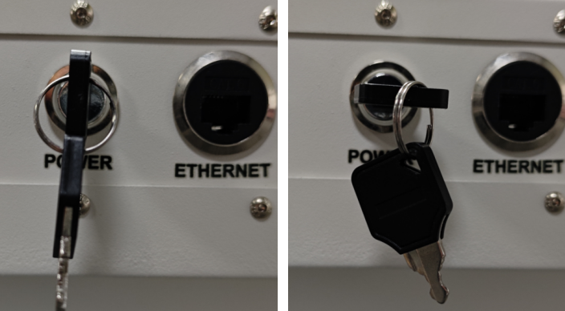
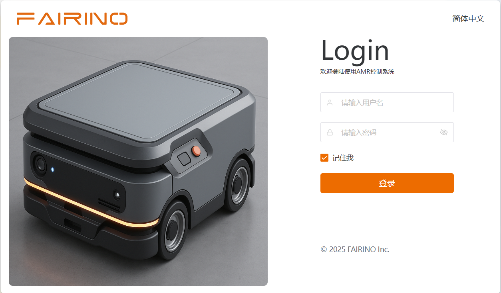
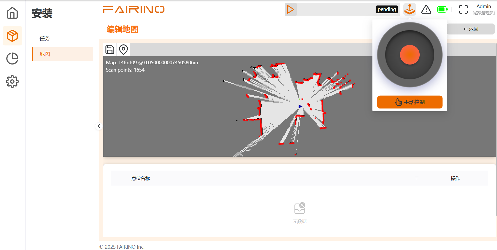
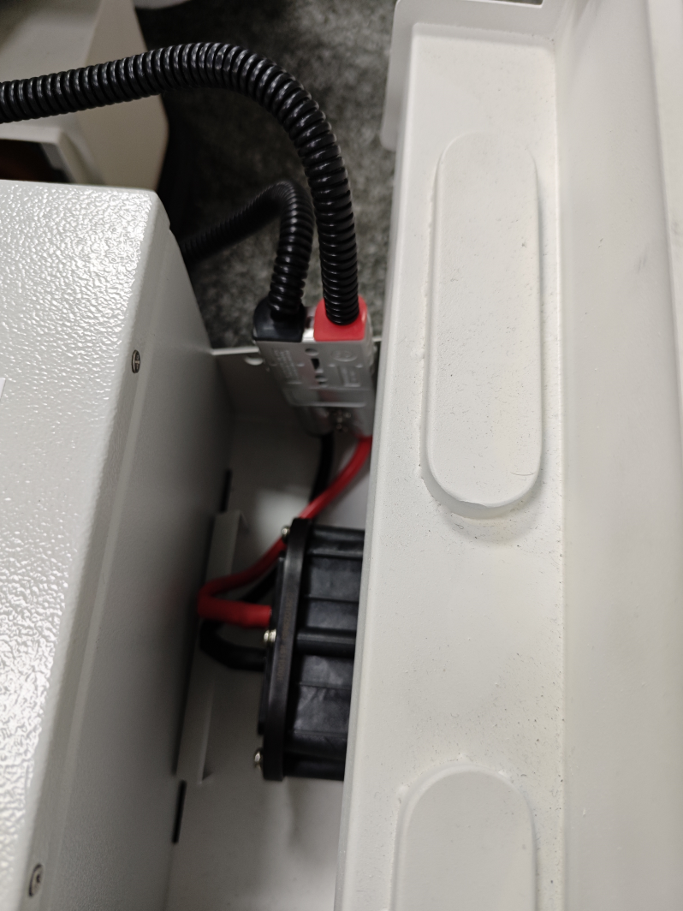

调试机器人开机
============================

.. toctree:: 
    :maxdepth: 5

添加机器人与AMR开启
---------------------------------------

设备上电
~~~~~~~~~~~~~~~~~~~~~~~~~~~~~~
左图为关机状态，顺时针切换为右图上电状态，设备上电。
  

.. centered:: 图表 5-1 机器人开机

连接AMR
---------------------------------------

用网线连接AMR和笔记本电脑，修改电脑ip为192.168.137.1。打开浏览器输入http://192.168.137.100:3000。用户名：admin；密码：123456；
  

.. centered:: 图表 5-2 登陆界面

手动摇杆控制
---------------------------------------

此部分功能允许用户通过软件界面直接与AMR进行交互，包括手动控制、环境建图。

**功能入口**：位于软件主界面的“手动控制”面板或导航栏。
  

.. centered:: 图表 5-3 摇杆控制界面

界面上的虚拟摇杆组件的使用步骤如下：

1. 确保机器人处于手动模式，并确认周围有足够的安全空间。
2. 找到并注视界面上的虚拟摇杆组件。
3. 将鼠标光标移至摇杆的中心点上。
4. 按住鼠标左键，根据预期运动方向拖动摇杆中心点：

- （1）向前或向后拖动：控制机器人沿直线前进或后退；拖拽幅度越大，机器人的移动速度越快。
- （2）向左或向右拖动：控制机器人向左或向右进行弧线运动或原地旋转。
- （3）向斜向拖动：合成线速度和角速度，使机器人沿相应的曲线路径移动。

5. 当需要停止机器人时，释放鼠标左键，摇杆将自动回中，机器人立即停止运动。

机器人充电
---------------------------------------

.. note:: 
   .. image:: image/002.png
      :height: 0.75in
      :align: left

   名称：**充电注意事项**
   
   说明：在指定用于AMR充换电的区域充电，应远离明火、高温、潮湿和人员密集作业场所，不得在该区域内设置车辆或电池的解体、焊装等维修场地。

AMR出厂电池可使用4-5小时，之后需要进行充电。请使用原装充电器，具体充电步骤如下：

1. 确保机器人目前没有任务并且处于停止状态。
2. 关闭AMR右侧的开关，整机立即断电，完成关机过程。

.. note:: 若因运输、维护或修理而关机，则必须关闭机器人电池开关。

手动充电
~~~~~~~~~~~~~~~~~~~~~~~~~~~~~~
  
.. figure:: image/039.png
   :align: center
   :width: 4in

.. centered:: 图表 5-4 电池抽屉的开关状态
  

.. centered:: 图表 5-5 充电连接器

在开启状态时抽出电池抽屉，拔出红框内的充电连接器，连接专用充电器给予充电，充电完成大约需2小时。