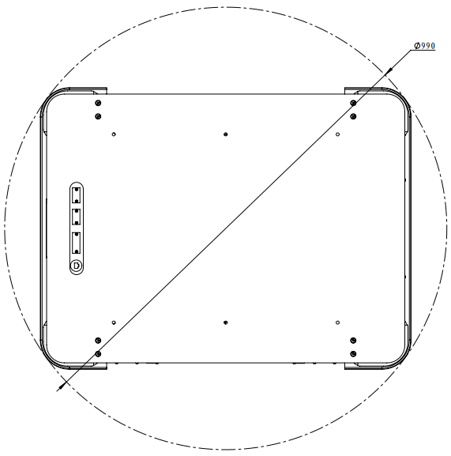
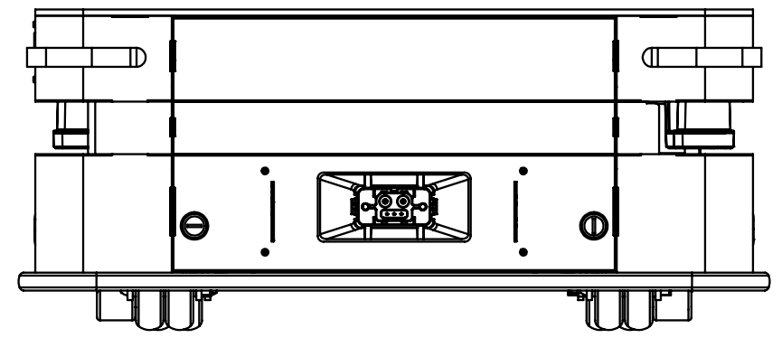
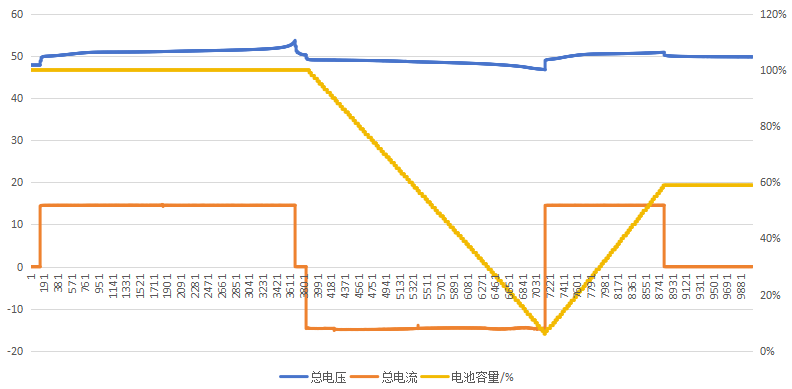
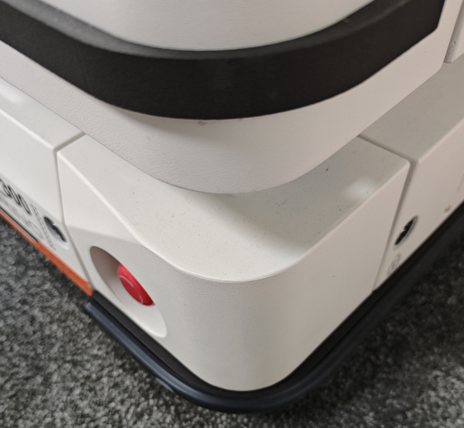

安全
================

.. toctree:: 
    :maxdepth: 5

.. note:: 
   .. image:: image/001.png
      :height: 0.75in
      :align: left

   名称：**注意**

   说明：1.对于以任何方式损坏、更换或改装 AMR或其附件而导致的问题，本公司概不负责。2.对于因编程错误或故障而导致 AMR、附件或任何其他设备发生的任何损坏，本公司概不负责。

.. note:: 在启动和运行AMR之前，请阅读本部分的内容。

一般安全注意事项
----------------------------------------------
本章包含一般安全注意事项

.. note:: 
   .. image:: image/002.png
      :height: 0.75in
      :align: left
   
   名称：**机器人倾翻注意事项**
   
   说明：1.若未能正确放置或固定负载，则可能导致负载掉落或机器人倾翻。2.确保根据规格放置负载并正确固定。请参阅有效荷载规格。

.. note:: 
   .. image:: image/002.png
      :height: 0.75in
      :align: left

   名称：**机器伤人注意事项**
   
   说明：1.车体高速回转部分会造成人员伤害，如万向轮、主动轮。2.请勿过分依赖车辆自主避让功能，请主动避让车辆。

.. note:: 
   .. image:: image/003.png
      :height: 0.75in
      :align: left

   名称：**运行注意事项**
   
   说明：1.机器人无法观察到下行楼梯和地板上的坑洞。2.请在地图上将楼梯和坑洞标记为禁止区域。3.请及时更新地图。

.. note:: 
   .. image:: image/003.png
      :height: 0.75in
      :align: left

   名称：**更换电池注意事项**
   
   说明：1.更换电池时，注意电池舱门夹手。2.更换电池后，请将电池舱门完全闭合锁定。避免电池在运行过程中滑出车体。

安全说明
----------------------------------------------

人员资质要求
~~~~~~~~~~~~~~~~~~~~~~~~~~~~~~~~~~~
AMR仅允许由合格的安全人员来安装、调试、操作和维护。机械安装和调试

进行机械安装和调试的人员应掌握相关领域的专业知识和经验，具备充分经验，能够评估机器在使用防护设备后是否处于安全运转状态。

电气安装和调试
进行电气安装和调试的人员应掌握相关领域的专业知识和经验，具备充分经验，能够评估机器在使用防护设备后是否处于安全运转状态。
操作和维护
进行操作和维护的人员应掌握相关领域的专业知识和经验，熟悉防护设备在机器上的应用并由机器使用者指导操作。

运行安全
~~~~~~~~~~~~~~~~~~~~~~~~~~~~~~~~~~~

运行环境安全。

- 地面平整，无沟槽，无破损，无空鼓，无油污、胶液等污染物。
- 地面无螺丝、抹布手套、线头线缆等易于卡住和缠绕轮子的异物。
- 不可运行在过度空旷区域（大于激光感知距离），如长走廊。
- 满载低速的机器人仅可跨越不高于5mm的台阶。
- 通过狭窄通道，机器人最外侧需与通道保持10mm间隙。
- 作区域的路段应进行防护或者用警示标牌加以标识提醒其他人员有机器人出入。

安全消息类型  
----------------------------------------------

本文档包含以下安全消息类型。

.. note:: 
   .. image:: image/002.png
      :height: 0.75in
      :align: left

   名称：**警告**
   
   说明：表示可能导致人员死亡或严重伤害的潜在危险情况。应采取适当的预防措施以避免损坏或伤害。

.. note:: 
   .. image:: image/003.png
      :height: 0.75in
      :align: left

   名称：**小心**
   
   说明：表示可能导致人员轻微或中度伤害的潜在危险情况。提醒避免不安全的行为。应采取适当的预防措施以避免损坏或伤害。

.. note:: 
   .. image:: image/001.png
      :height: 0.75in
      :align: left

   名称：**注意**
   
   说明：表示重要信息，包括可能导致设备或财产损坏的情况。

运行检查

- 操作者在启用前应检查机器人的状况，以确保安全使用。检查事项包括：
- 车轮紧固件是否拧紧。
- 动力系统是否正常。
- 急停功能是否正常。
- 载荷搬运装置是否有损坏（如弯曲、裂纹或磨损）。
- 警示装置是否正常。
- 氛围灯是否正常。
- HMI显示屏（选配，可以用笔记本电脑代替）是否正常。
- 激光传感器的功能是否正常。
- 电池电量是否正常。
- 充电功能是否正常。
  
在坡道上运行

- 仅允许在符合性能参数的坡道上运行，请参阅3.11技术参数通过性。
- 坡道的上下两端应平坦，防止负载或机器人接触地面。
- 禁止在坡道上掉头、斜向运行或停车。
- 牵引车在牵引无制动的拖车下坡运行时，不应紧急制动。

在电梯或升降机中运行

- 确保电梯或升降机能承受包括机器人及其负载的全部重量
- 确保机器人的任何部位不与电梯或升降机的轿厢壁接触。
- 确保机器人不得有意外的移动。
- 确保电梯符合GB7588-2003标准。

载荷安全
~~~~~~~~~~~~~~~~~~~~~~~~~~~~~~
- AMR及其负载不得超过路面允许的范围。
- 运载的货物须有可靠的固定措施。
- 运载的货物须放置在载荷中心内，且有一定的防滑措施，请参阅7.有效荷载规格。
- 上层机构承载的货物重量必须均匀分布，不得偏载。

停车安全
~~~~~~~~~~~~~~~~~~~~~~~~~~~~~~

- 机器人停止运行时，应关机并切断电源。
- 不得停靠在坡道上。
- 不得停靠在热源，火源旁边。
- 不得停靠在露天坑、地下通道、电梯井道或其他类似区域。
- 不得停靠在防火通道、楼梯口及阻碍消防设备通道的区域。
- 特殊情况下，应对机器人采取安全措施，如采用楔块。

安全避让范围
~~~~~~~~~~~~~~~~~~~~~~~~~~~~~~

.. warning:: 机器人的回转直径为990mm，请注意避让。

.. centered:: 图表 2-1 安全避让范围

电气安全
----------------------------------------------

电池安全
~~~~~~~~~~~~~~~~~~~~~~~~~~~~~~~~~~~~~~~~~

为避免电池组滥用造成损伤或人身伤害，请认真阅读以下安全指南：

.. note:: 
   .. image:: image/002.png
      :height: 0.75in
      :align: left

   名称：**电池使用注意事项**
   
   说明： 1. 锂电池属高能量物质，必须在一定的技术条件下使用。如超限使用，买方必须以书面形式 通知卖方，卖方确认后方可进行，否则产生的后果由过失方承担。2.请使用原装充电器。禁止混用其他品牌充电器，否则会给电池造成不可逆损伤。

电池组具备火灾、爆炸等风险，勿将电池组分解、压碎、焚化、加热或投入火中。

- 对于处于报废状态的电池组，应根据当地的回收或废弃物法规及时处理。
- 勿将电池组投入水中或将其弄湿。
- 勿将电池组正负极与金属壳体同时接触。
- 勿将电池组短路、过充或过放。
- 勿在热源（如火或加热器）附近使用或储存电池组。
- 勿将电池组正负极接反。
- 勿用钉子或其它尖锐物体刺穿电池组壳体，禁止锤击或脚踏电池组。
- 勿擅自以任何方式拆卸或修整电池组。
- 勿撞击、投掷或者使电池组受到机械振动及自然跌落。
- 勿将不同种类、不同品牌的电池组混合使用。
- 如果电池组发出异味、发热、变形、变色或出现其他任何异常现象时不得使用，并将电池组转移出使用环境。
- 如果电池组起火，需用干粉、泡沫灭火器、沙子等熄灭并将电池组远离使用环境。

充电安全
~~~~~~~~~~~~~~~~~~~~~~~~~~~~~~~~~~~~~~~~~

.. note:: 请注意机器人后o部的自动充电接口。

.. centered:: 图表 2-2 自动充电口

.. centered:: 图表 2-3 放充电曲线

急停安全
~~~~~~~~~~~~~~~~~~~~~~~~~~~~~~~~~~~~~~~~~

AMR设有两个急停按钮，呈对角分布。

.. centered:: 图表 2-4 急停按钮的位置

发现异常，如AMR失控、碰撞风险、人员安全威胁，立即按下急停按钮。按急停按钮后，通知相关人员，如技术人员、主管。技术人员排查故障，解决问题后，按复位程序操作，顺时针旋转急停按钮解锁，再重新按启动按钮启动AMR。非紧急勿按，否则影响生产流程，致设备故障。

具体急停行为如下：

- 急停按钮仅限用于紧急情况，不得用于停止机器人运行。
- 急停按钮按下后，机器人立即停止一切运动。
- 只有在确定故障原因并排除故障的情况下方可拔起急停。

.. note:: 
   .. image:: image/002.png
      :height: 0.75in
      :align: left

   名称：**机器人急停注意事项**
   
   说明：使用本公司调度系统时，严禁按下急停后推行机器人，否则会导致机器人任务出错

风险评估
----------------------------------------------

风险评估是集成商实现安全安装重要步骤之一。通常由现场调试人员负责风险评估。

风险评估不仅涉及AMR底盘，还要考虑上层机构、外设模块、路径规划、工作环境等。

建议使用ISO 12100、ISO 3691-4、ANSI B56.5或其他相关标准中的指南进行风险评估。包括但不仅限于：

- 在AMR安装、开发和使用的过程中，进行示教。
- AMR设备正常工作。
  
在ISO 3691-4第4款中，列出需注意的重大危险、危险情况和事件，应在技术协议中列出风险评估项。

剩余风险
----------------------------------------------

以下列出潜在的重大危险，请谨慎操作AMR。

- AMR可以设置倒走路线，但如果车尾没有传感器，倒走时进入AMR运行路线，有被撞击的风险。
- 用户不慎接触到AMR的运动部件，有被夹手、压脚、撞击的风险。
- 负载运输时有撞击、卡住、掉落的风险。

环境安全 
----------------------------------------------

噪音
~~~~~~~~~~~~~~~~~~~~~~~~~~~~~~~~~
AMR的噪声≤75 dB(A)，符合EN12053标准。

报废处理
~~~~~~~~~~~~~~~~~~~~~~~~~~~~~~~~~

AMR包含如下影响环境因素的材料：

- 塑料
- 电池
  
处理要求：AMR由使用者及最终报废处理者，负责按照《中华人民共和国固体废物污染环境防治法》进行处理。

操作器安装高度要求
----------------------------------------------

依据机械安全标准 IEC 60204-1制定。安装高度：设备的操作界面（例如笔记本电脑的键盘面）距离地面的最终高度，需超过 0.6 米 (600 mm)。

负载转移安全规定
----------------------------------------------

依据：ISO 3691-4制定。进行人工负载装卸或转移时，车辆必须处于断电、或急停激活状态，以防止意外启动，确保人员安全。