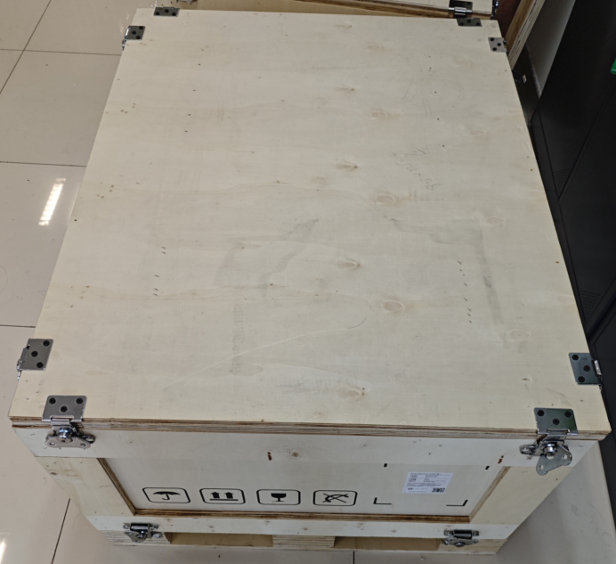
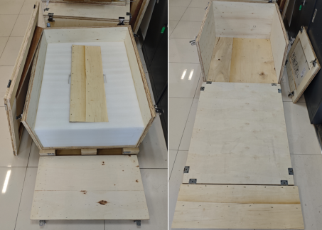

开始使用
================

.. toctree:: 
    :maxdepth: 5

随箱物品
-----------------------------

- AMR机器人本体
- 手动充电器具有独立的包装
  
使用说明
-----------------------------

本章介绍如何开箱AMR。

.. note:: 
    注意：请保存好原包装，以备日后运输机器人使用。

1. 手动旋转松开蝴蝶扣以拆卸盖板。
2. 取下盖板（斜坡），取出斜坡辅助板。
3. 拆卸侧板，取出保护泡沫板，将斜坡搭好。
4. 将机器人通过斜坡推下地面，此过程请小心谨慎，防止磕碰。

.. centered:: 图表 4-1 AMR包装

.. centered:: 图表 4-2 取下盖板
